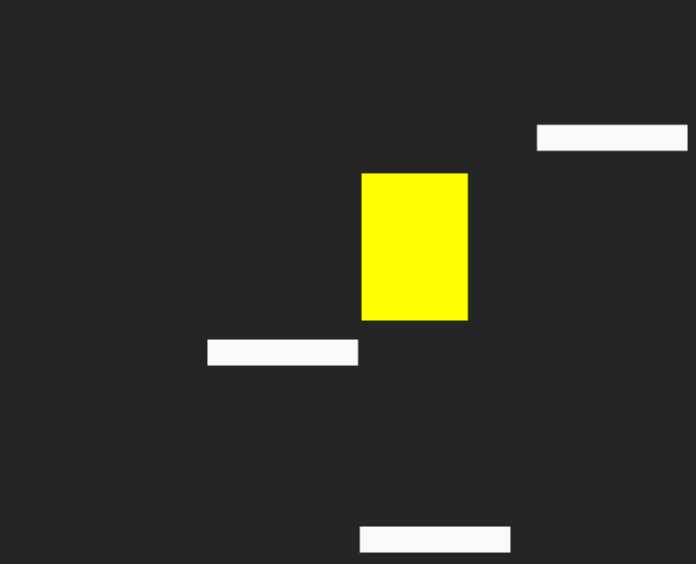

# Clone Doodle Jump

> Clone do jogo Doodle Jump para estudar conceitos de Javascript.

## ☕ Usando Doodle Jump

Para usar Doodle Jump, siga estas etapas:

Você pode acessar o projeto online [neste](https://levxyca-doodlejump.netlify.app) link ou baixar o projeto para sua máquina local e abrir o index.html no seu navegador de preferência.